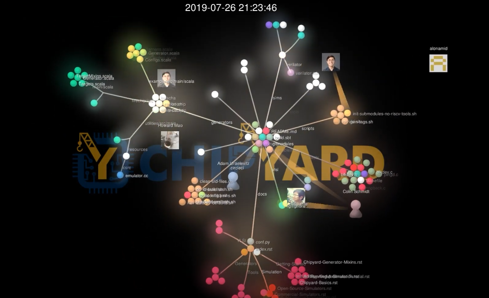

# Retreat-Animation-Script

[](https://www.youtube.com/watch?v=aN10VW1wRUo&t=5s)

Script used to create the "Chipyard Timeline" series animation, used during SLICE retreat break


```bash
gource -1920x1080 -o gource.ppm --date-format "%Y-%m-%d %H:%M:%S" --font-size 32 --user-image-dir .git/avatar/ --seconds-per-day 0.1 --file-idle-time 0 --background-image ./bg.png
```


```bash
ffmpeg -y -r 60 -f image2pipe -vcodec ppm -i gource.ppm -vcodec libx264 -preset medium -pix_fmt yuv420p -crf 1 -threads 0 -bf 0 gource.mp4
```

https://github.com/acaudwell/Gource/wiki/Visualizing-Multiple-Repositories
